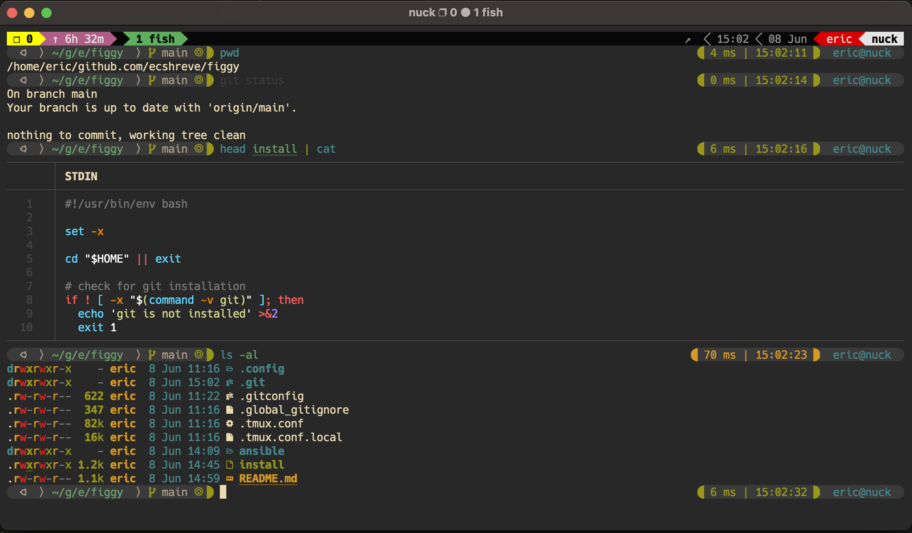
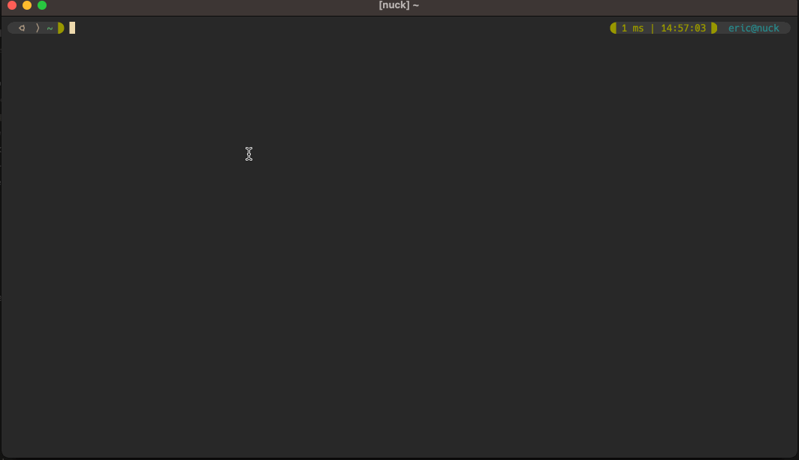

# figgy

This repo contains my personal dotfiles and configurations.

 

## installation / setup

For the most part I install this configuration on linux virtual machines
running in proxmox. Some of these tools and parts of the setup are baked 
into the docker images built from this repo: [dev-env](https://github.com/ecshreve/dev-env).

This is the one liner I use from a terminal, ansible playbook, dockerfile,
or shell script.

`curl https://raw.githubusercontent.com/ecshreve/figgy/main/install | bash -s`

## fish

fish prompt and tmux status line

 

## fzf

`CTRL+r`: launch fzf command history viewer

`CTRL+f + f`: launch fzf file/directory viewer

`CTRL+f + p`: launch fzf process viewer

`CTRL+f + v`: launch fzf variable viewer

demo

 

## git + fzf

_if the current directory is a git repository, the following also apply:_

`CTRL+f + l`: launch fzf git log viewer

`CTRL+f + s`: launch fzf git status viewer

`ga`: interactive `git add` with forgit::fzf

 

## notes

The general file and git repository structure, and the core functionality were more or less copy-pasted from [monks's dotfile repo](https://github.com/amonks/setup). For fun and to learn some new things I used that repository as a template and implemented/adapted it in chunks for my configuration.

The `rev1-11-22` branch was created when I had everything running how I wanted. After that branch is where I start streamlining and remove a bunch of config options that I don't need.