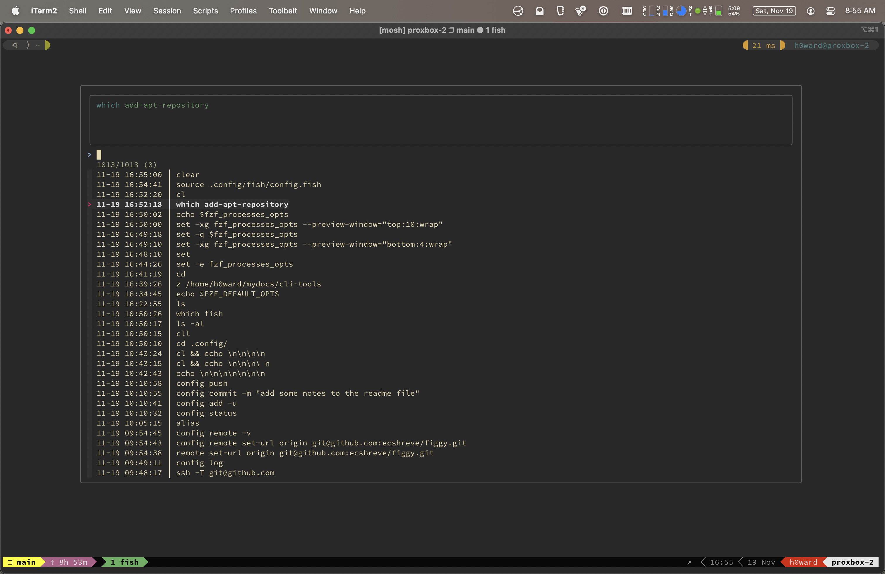
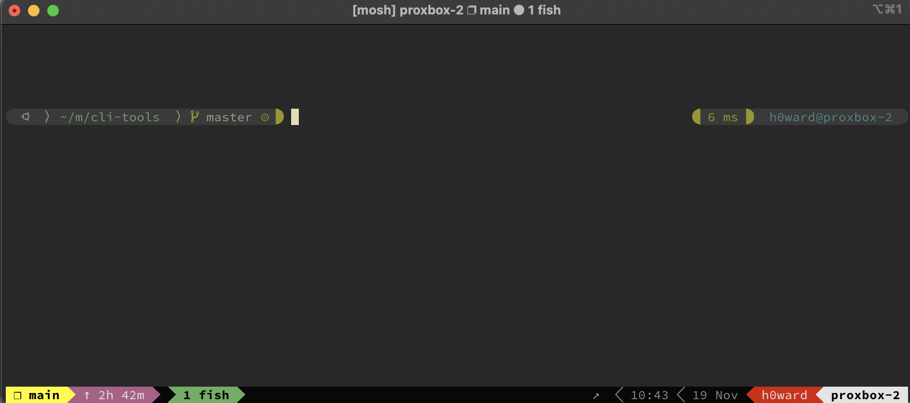

# figgy

This repo contains my personal dotfiles and configurations.

The general file and git repository structure, and the core functionality were more or less copy-pasted from [monks's dotfile repo](https://github.com/amonks/setup). For fun and to learn some new things I used that repository as a template and implemented/adapted it in chunks for my configuration.

The `rev1-11-22` branch was created when I had everything running how I wanted. After that branch is where I start streamlining and remove a bunch of config options that I don't need.

## favorite things

`CTRL+r` : FZF search through command history

fully custom prompt and status line

## tools and usage

### fzf

- launch fzf command history viewer

`CTRL+r`

- launch fzf file/directory viewer

`CTRL+f + f`

- launch fzf process viewer

`CTRL+f + p`

- launch fzf variable viewer

`CTRL+f + v`

_if the current directory is a git repository, the following also apply:_

- launch fzf git log viewer

`CTRL+f + l`

- launch fzf git status viewer

`CTRL+f + s`

- interactive `git add` with forgit::fzf

`ga`
